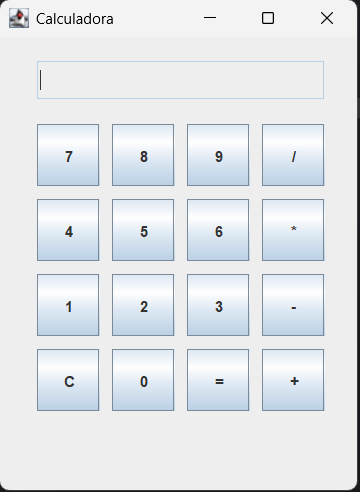

#  Calculadora-Desktop 🧮

Uma calculadora de desktop simples, desenvolvida em Java com a biblioteca Swing para a interface gráfica. O projeto implementa as quatro operações aritméticas básicas de forma intuitiva e funcional.

## Visualização



> **Nota:** Você pode substituir o link acima por uma captura de tela que você mesmo tirar do projeto em execução.

---

## ✨ Funcionalidades

* **Operações Básicas**: Realiza cálculos de adição (`+`), subtração (`-`), multiplicação (`*`) e divisão (`/`).
* **Interface Simples**: Todos os botões numéricos e de operações estão dispostos de forma clara e familiar.
* **Limpar Visor**: O botão `C` (Clear) limpa o visor e reinicia qualquer operação em andamento.
* **Tratamento de Erro**: O sistema exibe uma mensagem de alerta ao tentar realizar uma divisão por zero, evitando que o programa quebre.

---

## 🛠️ Tecnologias Utilizadas

O projeto foi construído utilizando as seguintes tecnologias:

* **Java**: Linguagem de programação principal.
* **Java Swing**: Biblioteca para criação da interface gráfica de usuário (GUI).

---

## 🚀 Como Executar o Projeto

Para executar a calculadora em sua máquina local, siga os passos abaixo. Você precisará ter o **JDK (Java Development Kit)** instalado.

1.  **Clone o repositório:**
    ```bash
    git clone [https://github.com/Luan-H/calculadora-desktop.git](https://github.com/Luan-H/calculadora-desktop.git)
    ```

2.  **Navegue até o diretório do projeto:**
    ```bash
    cd calculadora-desktop
    ```

3.  **Compile o arquivo Java:**
    ```bash
    javac App.java
    ```

4.  **Execute o programa:**
    ```bash
    java App
    ```

Após executar o último comando, a janela da calculadora será aberta.

---

## 👨‍💻 Autor

Feito com ❤️ por **[Luan Henrique Ribeiro de Sousa]**.
